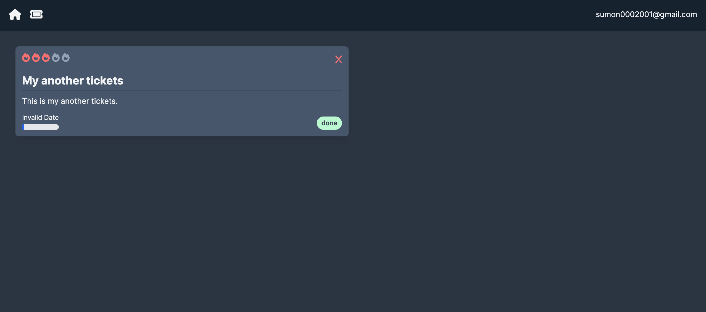

<div align="center">
  <br />
   
   <a href="" target="_blank">
      
        
    </a>

  <br />

  <div>
    
    
    
    
    
  </div>

  <h3 align="center">Ticket App</h3>

</div>

## 📋 <a name="table">Table of Contents</a>

1. 🤖 [Introduction](#introduction)
2. ⚙️ [Tech Stack](#tech-stack)
3. 🔋 [Features](#features)
4. 🤸 [Quick Start](#quick-start)
5. 🕸️ [Snippets](#snippets)
6. 🔗 [Links](#links)
7. 🚀 [More](#more)

## <a name="introduction">🤖 Introduction</a>

Build a Ticket App. This App can be used in the office for work management. One can create a ticket, assign it to a team member, and track the ticket's progress.

## <a name="tech-stack">⚙️ Tech Stack</a>

- Next.js

- MongoDB

- TailwindCSS

## <a name="features">🔋 Features</a>

👉 **Ticket Management**: Create, assign, and track tickets efficiently

👉 **Team Collaboration**: Share tickets with team members and coordinate efforts

👉 **Progress Tracking**: Monitor ticket status and update progress in real-time

## <a name="quick-start">🤸 Quick Start</a>

Follow these steps to set up the project locally on your machine.

**Prerequisites**

Make sure you have the following installed on your machine:

- [Git](https://git-scm.com/)
- [Node.js](https://nodejs.org/en)
- [npm](https://www.npmjs.com/) (Node Package Manager)

**Cloning the Repository**

```bash
git clone https://github.com/sumon0002001/ticketing-app.git
cd ticketing-app
```

**Installation**

Install the project dependencies using npm:

```bash
npm run dev
```

**Set Up Environment Variables**

Create a new file named `.env.local` in the root of your project and add the following content:

````env


#MONGODB
MONGODB_URL=


**Running the Project**

```bash
npm run dev
````

Open [http://localhost:3000](http://localhost:3000) in your browser to view the project.

<br />
<br />
